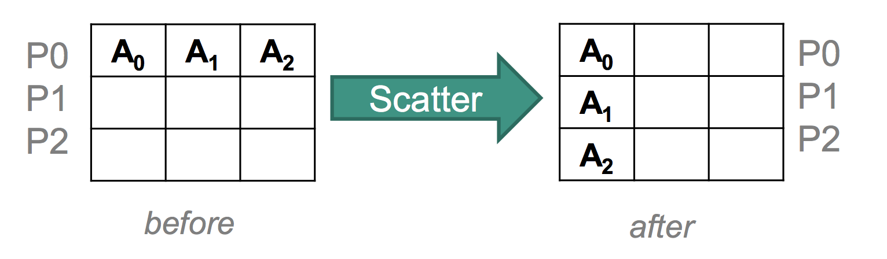
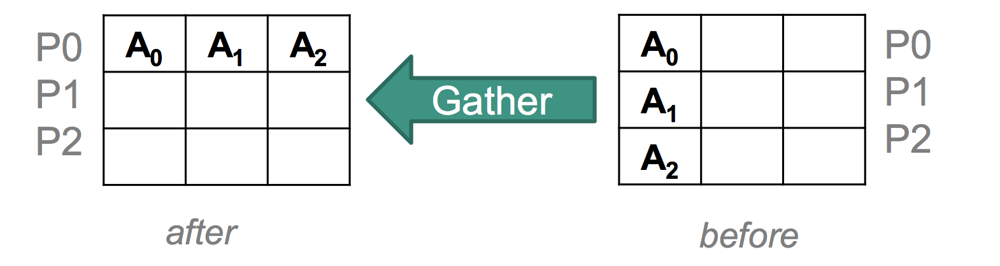
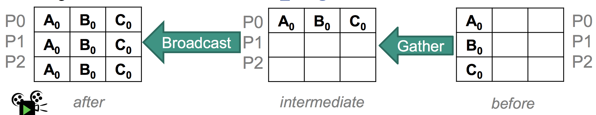
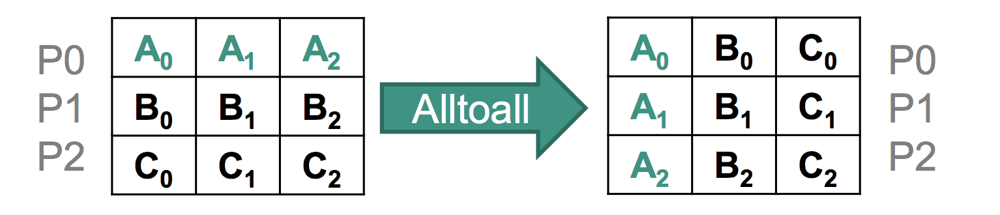
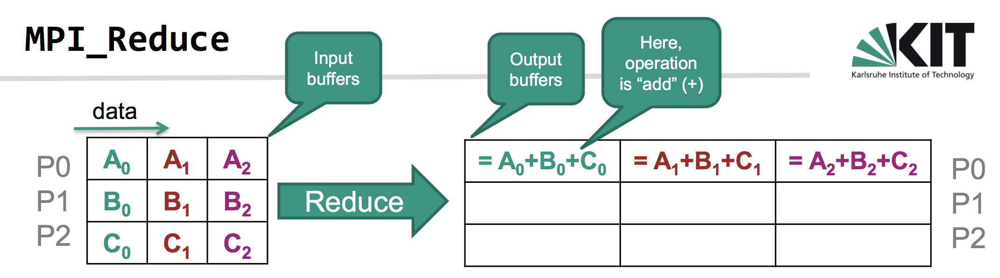

# Propa API

## Prolog

---

```prolog
   % --- More efficient to define non_member separately instead of
   % --- as not(member(X,L))
   
   non_member(X,Y|T]) :- X \== Y, non_member(X,T).
   non_member(X,[]).
   
   % --- Remove duplicates from list 
   
   make_set([],[]).
   make_set(X,Y) :- setof(Z,member(Z,X),Y).
   
   % --- append two lists (duplicates ARE preserved) 
   % --- note why append(X,L,[X|L]). can cause trouble
   
   append([],X,X).
   append([X|Y],Z,[X|W]) :- append(Y,Z,W).
   
   % --- make a new set with all members except A 
   
   delete(A,[A|X],X).
   delete(A,[B|X],[B|Z]) :- delete(A,X,Z).
   
   % --- is X a subset of Y ? 
   
   subset([A|X],Y) :- member(A,Y), subset(X,Y).
   subset([],Y).
   
   % --- set intersection 
   
   intersect([],Y,[]).
   intersect([X|R],Y,[X|Z]) :- member(X,Y),!,intersect(R,Y,Z).
   intersect([X|R],Y,Z) :- non_member(X,Y),!,intersect(R,Y,Z).
   
   % --- set difference 
   
   difference([],Y,[]).
   difference([X|R],Y,Z) :- member(X,Y),!,difference(R,Y,Z).
   difference([X|R],Y,[X|Z]) :- difference(R,Y,Z).
   
   % --- set union 
   
   union([],X,X).
   union([X|R],Y,Z) :- member(X,Y), !, union(R,Y,Z).
   union([X|R],Y,[X|Z]) :- union(R,Y,Z).
   
   % --- make a new set Y with new element A and old set X
   
   insert(A,X,Y) :- union([A],X,Y).
   
   % --- get the nth member of list 
   
   nth([F|R],1,F).
   nth([F|R],N,M) :- N > 1, N1 is N-1, nth(R,N1,M).
   
   % --- are two sets equal? 
   
   equal(X,X).
   equal(X,Y) :- difference(X,Y,[]), difference(Y,X,[]).
   
   % --- flatten list of lists into list 
   
   flatten([],[]).
   flatten([[]|L],L).
   flatten([X|L1],[X|L2]) :- atomic(X), flatten(L1,L2).
   flatten([X|L1],L4) :- flatten(X,L2),
                         flatten(L1,L3),
                         append(L2,L3,L4).
```

## MPI

---

```MPI_COMM_WORLD```: Default communicator

```MPI_Barrier```: Blocks until all processes have called it
```c
MPI_Barrier(MPI_COMM_WORLD);
```

```MPI_Send```: Blocks until the message buffer can be reused

```c
/**
 * buf: the pointer to the sender's buffer
 * count/datatype: number/type of buffer's elements 
 * dest: rank of the destination process
 * tag: "context" of the message (e.g. a conversion ID) 
 * comm: communicator of the process group
 */
int MPI_Send(void* buf,
             int count,
             MPI_Datatype datatype,
             int dest,
             int tag,
             MPI_Comm comm)
```

```MPI_Recv```: Blocks until message is received in the buffer *completely*

```c
/**
 * MPI_Status: status, is required because tag and 
 * source can be unknown due to wildcards
 */
int MPI_Recv(void* buf, 
             int count,
             MPI_Datatype datatype,
             int source,
             int tag,
             MPI_Comm comm,
             MPI_Status* status)
```

```MPI_Isend```: MPI_Send but *non-blocking* (I stands for immediate)

```c
int MPI_Isend(void* buf,
              int count,
              MPI_Datatype type,
              int dest,
              int tag,
              MPI_Comm comm,
              MPI_Request* request)
```

```MPI_Irecv```: MPI_Recv but *non-blocking* (I stands for immediate)

```c
int MPI_Irecv(void* buf,
              int count,
              MPI_Datatype type,
              int src,
              int tag,
              MPI_Comm comm,
              MPI_Request* request)
```

```MPI_Test```: Checks send and receive operations for completion (*blocking*)

```c
int MPI_Test(MPI_Request* r, int* flag, MPI_Status* s)
```

```MPI_Wait```: Checks send and receive operations for completion (*non-blocking*)


```c
int MPI_Wait(MPI_Request* r, MPI_Status* s)
```

```MPI_Bcast```: Distribute date to all processes

```c
/**
 * root is the rank of the message sender and
 * uses buffer to provide data.
 * 
 * All others (i.e. receivers) use buffer for
 * receiving data 
 */
int MPI_Bcast(void* buffer,
              int count,
              MPI_Datatype t,
              int root,
              MPI_Comm comm)
```

```MPI_Scatter```: All receivers get equal-sized but content-different data.



```c
// inverse of MPI_Gather
int MPI_Scatter(void* sendbuf,
                int sendcount,
                MPI_Datatype sendtype,
                void* recvbuf,
                int recvcount,
                MPI_Datatype recvtype,
                int root, MPI_Comm comm)

/**
 * Allows varying counts for data sent to each process
 *
 * sendcounts: integer array with the number of
 * elements to send to each process
 * 
 * displacements: integer array, entry i specifies
 * the displacement relative to sendbuf from which
 * to take the outgoing data to process i
 * (gaps allowed but no overlaps)
 * 
 * sendtype: data type of send buffer elements (handle) 
 * recvcount: number of elements in receive buffer (integer) 
 * Recvtype: data type of receive buffer elements (handle)
 */
int MPI_Scatterv(void* sendbuf,
                 int* sendcounts,
                 int* displacements,
                 MPI_Datatype sendtype,
                 void* recvbuf,
                 int recvcount,
                 MPI_Datatype recvtype,
                 int root,
                 MPI_Comm comm)
```

```MPI_Gather```:



```c
/**
 * root's buffer contains collected data sorted by rank,
 * including root's own buffer contents
 * Receive buffer is ignored by all non-root processes
 * 
 * recvcount: number of items received from each process,
 * not the total aggregated number
 */
int MPI_Gather(void* sendbuf,
               int sendcount,
               MPI_Datatype sendtype,
               void* recvbuf,
               int recvcount,
               MPI_Datatype recvtype,
               int root,
               MPI_Comm comm)
```

```MPI_Allgather```: Basically this is a gather + broadcast



```c
// Vector variant is MPI_Allgatherv
int MPI_Allgather(void* sendbuf,
                  int sendcount,
                  MPI_Datatype sendtype,
                  void* recvbuf,
                  int recvcount,
                  MPI_Datatype recvtype,
                  MPI_Comm comm)
```

```MPI_Alltoall```:



```c
int MPI_Alltoall(void *sendbuf,
                 int sendcount,
                 MPI_Datatype sendtype,
                 void *recvbuf,
                 int recvcount,
                 MPI_Datatype recvtype,
                 MPI_Comm comm)
```

```MPI_Reduce```: Applies an operation to the data in ```sendbuf``` and stores the result in ```recvbuf``` of the root process



```c
int MPI_Reduce(void* sendbuf,
               void* recvbuf,
               int count,
               MPI_Datatype type,
               MPI_Op op,
               int root,
               MPI_Comm comm)
```


## AKKA

### Methods of an actor:

```preStart()```: Executed before an actor is started 

```postStop()```: Executed after an actor is stopped

```preRestart()``` / ```postRestart()```: Executed before/after an actor is restarted

```getSelf()```: delivers a reference (ActorRef) to the actor

```getContext()```: delivers an ActorContext, which is especially an ActorRefFactory (for creating new actors)

```getSender()```: delivers a reference to the actor sending the currently processed message

### Communication

```ask```: Sends a message asynchronously an returns immediately

```scala
Future<?> Patterns.ask(ActorRef target, Object msg, Timout timeout)
```

```tell```: Sends a message asynchronously and returns a Future for the possible reply

```scala
void tell(Object message, ActorRef sender)
````

```await```: Sender can wait for the result (try to avoid it)

```scala
 T Await.result(Future<T> future, Duration duration)
```

```forward```: Forwards messages, preserving the original sender

```scala
void forward(Object message, ActorContext context)
```

### Stopping an actor

```stop```: Stops asynchronously

```scala
void stop(ActorRef actorToStop)
```

```PoisonPill```: Sent via ordinary send operation

```scala
PoisonPill.getInstance()
```