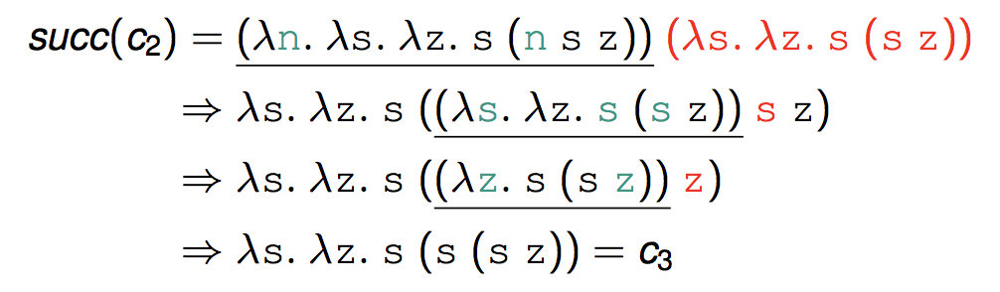
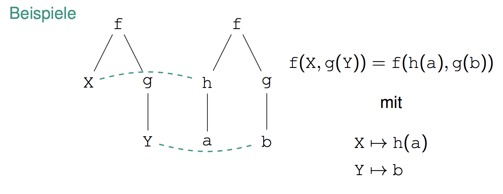

# Propa Review

<!-- @import "[TOC]" {cmd="toc" depthFrom=1 depthTo=6 orderedList=false} -->
<!-- code_chunk_output -->

- [Propa Review](#propa-review)
- [Funktionale Programmierung](#funktionale-programmierung)
    - [Haskell](#haskell)
        - [Tail recursion (Endrekursion) [F39]](#tail-recursion-endrekursion-f39)
        - [Funktionen auf Listen [F60]](#funktionen-auf-listen-f60)
        - [Currying [F69]](#currying-f69)
        - [```let```, ```where``` & Bindung [F79]](#let-where-bindung-f79)
        - [Kombinatoren [F85]](#kombinatoren-f85)
        - [List Comprehensions [F102]](#list-comprehensions-f102)
        - [Lazy Evaluation [F110]](#lazy-evaluation-f110)
        - [Typen [F131]](#typen-f131)
        - [Datentypen [F159]](#datentypen-f159)
            - [Algebraische Datentypen:](#algebraische-datentypen)
            - [Polymorphe Datentypen:](#polymorphe-datentypen)
            - [Rekursive Datentypen:](#rekursive-datentypen)
        - [Typklassen [F196]](#typklassen-f196)
        - [Funktoren [F212]](#funktoren-f212)
        - [Monaden [F247]](#monaden-f247)
    - [λ-Kalkül [F270]](#%CE%BB-kalk%C3%BCl-f270)
        - [Untypisierte λ-Kalkül [F273]](#untypisierte-%CE%BB-kalk%C3%BCl-f273)
            - [α-Äquivalenz:](#%CE%B1-%C3%A4quivalenz)
            - [η-Äquivalenz:](#%CE%B7-%C3%A4quivalenz)
            - [β-Reduktion:](#%CE%B2-reduktion)
        - [Church Zahlen [F307]:](#church-zahlen-f307)
            - [Church-Zahl [F307]:](#church-zahl-f307)
            - [Church Booleans [F324]:](#church-booleans-f324)
            - [Y Kombinator [F337]:](#y-kombinator-f337)
            - [Church Rosser Satz:](#church-rosser-satz)
        - [Auswertung in Programmiersprachen [F343]:](#auswertung-in-programmiersprachen-f343)
            - [Call by Name:](#call-by-name)
            - [Call by Value:](#call-by-value)
        - [Regelsysteme [F351]:](#regelsysteme-f351)
        - [Typsystem [F362]:](#typsystem-f362)
            - [Typschemata & Polymorphismus](#typschemata-polymorphismus)
    - [Prolog (Logische Programmierung)](#prolog-logische-programmierung)
        - [Backtracking [F416]:](#backtracking-f416)
        - [Listen [F444]:](#listen-f444)
        - [Unifikation [F447]:](#unifikation-f447)
        - [Cut [F481]:](#cut-f481)
        - [Unifikation [F519]:](#unifikation-f519)
        - [Resolutionsprinzip [F553]:](#resolutionsprinzip-f553)
    - [Memory Management [F646j];](#memory-management-f646j)
        - [C:](#c)
        - [C++:](#c)
    - [Parallel Programming [F620]:](#parallel-programming-f620)
        - [MPI [F668]:](#mpi-f668)
        - [Parallelität in Java [F709]](#parallelit%C3%A4t-in-java-f709)
        - [Scala [F]](#scala-f)
                - [Traits:](#traits)
        - [Actor Model [F761]](#actor-model-f761)
        - [AKKA [F771]](#akka-f771)
    - [Design by Contract](#design-by-contract)
        - [Hoare-Triple:](#hoare-triple)
        - [Contracts](#contracts)
    - [Compilerbau [F855]](#compilerbau-f855)
        - [Syntaktische Analyse](#syntaktische-analyse)
        - [Semantische Analyse](#semantische-analyse)
        - [Java Byte Code [F930]](#java-byte-code-f930)
        - [Codeerzeugung [F957]](#codeerzeugung-f957)

<!-- /code_chunk_output -->

# Funktionale Programmierung
## Haskell

---

### Tail recursion (Endrekursion) [F39]

---

__Lineartät:__ Eine Funktion heißt linear rekursiv, wenn in jedem Definitionszweig nur ein rekursiver Aufruf vorkommt. 

__Endrekursion:__ Eine linear rekursive Funktion heißt endrekursiv (tail recursive), wenn in jedem Zweig der rekursive Aufruf nicht in andere Aufrufe eingebettet ist.

- Endrekursion ermöglicht speicher-effiziente Auswertung

### Funktionen auf Listen [F60]

---

- length, head, tail, elem
- ++: [1] ++ [2,3] = [1,2,3]
- take: take first n from start of list and return them
- drop: remove first n elements from list and return rest

### Currying [F69]

---

Ersetzung einer mehrstelligen Funktion durch Schachtelung einstelliger Funktionen

**Currying Bsp:** 

```haskell
-- | Definition mit λ
f :: Double -> (Double -> Double)
f a = \x -> a * x

-- | als ”mehrstellige“ Funktion
f :: Double -> Double -> Double
f a x = a * x
``` 

- Funktionen in Haskell sind gecurrieht
- Funktionsanwendung ist links-assoziativ: f 3 7 ≡ (f 3) 7
- Funktionstypen sind rechts-assoziativ: Int -> Int -> Int ≡ Int -> (Int -> Int)

**Unterversorgung:**

- Anwendung “mehrstelliger” Funktionen auf zu wenige Parameter
- Currying und Unterversorgung möglich durch **Extensionalitäsprinzip** 

**Unterversorgung Bsp:**

```haskell
-- | nicht unterversorgt
add5 list = map (\x -> 5 + x) list

-- | map und 'plus' operation werden unterversorgt
add5 :: [Integer] -> [Integer]
add5 = map (5+)
```

**Extensionalitäsprinzip:**

```
f, g : A → B
f = g ⇐⇒ ∀ x ∈ A : f(x) = g(x)
```

(hintere Form heißt punktweise Definition)

### ```let```, ```where``` & Bindung [F79]

---

```haskell
-- | let, c is bound, m is free
energy m = let c = 299792458
    in m * c * c

-- | where, c is bound, m is free
energy m = m * c * c 
    where c = 299792458
```

### Kombinatoren [F85]

---

fold:
```haskell
-- | foldr
foldr op i [] = i
foldr op i (x:xs) = op x (foldr op i xs)

-- | foldl
foldl op i [] = i
foldl op i (x:xs) = foldl op (op i x) xs

-- | Bsp Summe über Liste:
sum :: [Int] -> Int
sum = foldr (+) 0

```

zipWith:
```haskell
zipWith :: (s -> t -> u) -> [s] -> [t] -> [u]
zipWith f xs     ys     =  []
zipWith f (x:xs) (y:ys) =  f x y : zipWith f xs ys
```

Other functions: filter, map, concat (ist flatMap), 

### List Comprehensions [F102]

---

```haskell
-- | map:
[f x | x <- l] ⇔ map (\x -> f x) l ⇔ map f l

-- | filter:
[x | x <- l, pred x] ⇔ filter (\x -> pred x) l ⇔ filter pred l

-- | filter & map:
[f x | x <- l, pred x] ⇔ map f (filter pred l)

-- | Bsp: gerade Zahlen <= n
evens n = [ x | x <- [0..n], x ‘mod‘ 2 == 0] 
evens 10 ⇒+ [0,2,4,6,8,10]

-- | Bsp: only take students that passed the exam (a is grade)
graduates :: Examination -> [Student]
graduates exam = [s | (s,a) <- exam, passed a ]

```

### Lazy Evaluation [F110]

---

**Streams:** unendliche listen

Bsp:

```haskell
-- Aufsteigend bis n
[1..n]
  
-- Aufsteigend unendlich
[1..]

-- Absteigend unendlich 
[..1]
```

- Repräsentiert als zyklische Graphen


Bsp:
```haskell
odds = 1 : map (+2) odds
```

### Typen [F131]

___

Typdeklaration:

```haskell
type Student = String
type Assessment = [Double]
type Submission = (Student,Assessment) 
type Examination = [Submission]
```

### Datentypen [F159]

---

#### Algebraische Datentypen:

```haskell
data Season = Spring | Summer | Autumn | Winter
```

####  Polymorphe Datentypen:

```haskell
-- | t ist Parameter und bestimmt was Maybe im Fall 'Just' zurückgibt
data Maybe t = Nothing | Just t 
Just True :: Maybe Bool
Nothing   :: Maybe String

-- | s, t sind vom Typ Int String
data Either s t = Left s | Right t 
Left 42      :: Either Int String 
Right "true" :: Either Int String
```

#### Rekursive Datentypen:

```haskell
-- | Stack definiert
data Stack t = Empty | Stacked t (Stack t)

-- | push Operation
push x s = Stacked x s

-- | pop Operation
pop Empty = error "Empty" 
pop (Stacked x s) = s

-- | top Operation
top Empty         = error "Empty"
top (Stacked x s) = x

-- | Beispiel von Stack mit [3, 1, Empty]
someStack :: Stack Integer
someStack  = Stacked 3 (Stacked 1 Empty)
```

### Typklassen [F196]

---

Idee: 
- Fassen Typen anhand auf ihnen definierter Operationen zusammen
- Alle Typen von einer Typklasse haben die gleichen Operationen
- Grob wie Java Interfaces

Bsp:
```Haskell
-- | Ord ist Typklasse, d.h. t muss von Typklasse Ord sein
qsort :: Ord t => [t] -> [t]
```

Definition einer Typklasse:

```haskell
-- | Die Operationen '==' und '/=' werden zu der Klasse Eq definiert
class (Eq t) where
    (==) :: t -> t -> Bool 
    (/=) :: t -> t -> Bool

    -- Default Implementierungen:
    -- invertiere die Rückgabewerte bei entgegengesetzter Operation
    x /= y = not (x == y) 
    x == y = not (x /= y)
```

Typklassen-Instanziierung:

```haskell
-- | Die Operation '==' wird für den Typen Bool definiert.
-- | Die Operation '/='muss nicht definiert werden, da das
-- | Inverse schon in der Klassendefinition definiert ist.
instance (Eq Bool) where 
    True  == True  = True
    False == False = True
    False == True  = False
    True  == False = False
```

Automatische Typklassen-Instanziierung:

Mit ```deriving```.

```haskell
data Shape = Circle Double
    | Rectangle Double Double
    | Square Double
    deriving Eq
```

Typklassen-Hierarchie:

Bsp:
```haskell
data Ordering = LT | EQ | GT 
class (Eq t) => Ord t where
    compare              :: t -> t -> Ordering
    (<), (<=), (>), (>=) :: t -> t -> Bool

compare x y
    | x == y = EQ 
    | x <= y = LT 
    | otherwise = GT

x < y = lt (compare x y) 
    where 
        lt LT = True
        lt _  = False 

x <= y = ...
```

- Jede Instanz von Ord auch Instanz von Eq

Standard Typklassen:


Generische Instanziierung:

Instanziierung Ord (s, t) von beliebigen Tupel-Typen
- Möglich, falls Ord t und Ord s

```haskell
instance (Eq s, Eq t) => Eq (s, t) where
    (a, b) == (a’, b’) = (a == a’) && (b == b’)

instance (Ord s, Ord t) => Ord (s, t) where
    (a, b) <= (a’, b’) = (a < a’) || (a == a’ && b <= b’)
```

### Funktoren [F212]

---

- Abbildung f von Typen auf Typen
- Zusammen mit Funktion

```haskell
m :: (s -> t) -> (f s) -> (f t)
```
sodass:

```haskell
m id = id
m (f . g) = (m f) . (m g)
```

Bsp mit Listen:

```haskell
class Functor f where
    fmap :: (s -> t) -> (f s) -> (f t)

instance Functor [] where 
    fmap = map
```

### Monaden [F247]

---

Idee:
- Verändert den Globalen Zustand (```RealWorld``` oder ```rw```) für Dinge wie IO
- Schreibe 'unreine' Funktionen, also Funktionen mit Nebeneffekte (bsp. IO)
- Erzeugen Modularität: Erlaubt komplexere Maschinerie in der Monade zu verstecken und so neue Funktionalität einfach hinzuzufügen

Monaden sind definiert durch ```bind``` und ```return```:
```haskell
-- bind:
(>>=) :: m a -> (a -> m b) -> m b

-- return:
return :: a -> m a
```
- Bind (>>=): schickt einen Wert durch die Monade in die nächste, schickt so zu sagen auch den neuen ```RealWorld``` Zustand mit
- return: 'Liftet' einen Wert in die Monade (in den '```RealWorld```' Zustand):

```haskell
-- | Ohne Monade, rw kann wegen unterversorgung weggelassen werden 
main rw = bind readLine (\s1 -> 
          bind readLine (\s2 -> 
          let output = s1 ++ s2
          in putLine output)) rw

-- | Mit Monade
main = do s1 <- readLine 
          s2 <- readLine
          let output = s1 ++ s2
          putLine output

-- | wobei bind:
bind f g rw = let (rw’, s) = f rw in g s rw’
````

Beispiel mit Liste:

```haskell
-- | List comprehension
[(x,y) | x <- [1,2,3] , y <- [1,2,3], x /= y]

-- | Monade
do x <- [1,2,3]
   y <- [1,2,3]
   True <- return (x /= y)
   return (x,y)
```

Simple StateMonade example:

```haskell
data SM a = SM (S -> (a,S))  -- The monadic type

instance Monad SM where
  -- defines state propagation:
  -- r is result, s0, s1 is realworld, c2 ist final result
  SM c1 >>= fc2         =  SM (\s0 -> let (r,s1) = c1 s0 
                                          SM c2 = fc2 r in
                                          c2 s1)
  -- lift value k into state (monade)
  return k              =  SM (\s -> (k,s))

 -- extracts the state from the monad
readSM                  :: SM S
readSM                  =  SM (\s -> (s,s))

 -- updates the state of the monad
updateSM                :: (S -> S) -> SM ()  -- alters the state
updateSM f              =  SM (\s -> ((), f s)) 

-- run a computation in the SM monad
runSM                   :: S -> SM a -> (a,S)
runSM s0 (SM c)         =  c s0
```

## λ-Kalkül [F270]

---

Was ist es?
- Turingmächtiges Modell funktionaler Programme

### Untypisierte λ-Kalkül [F273]

---

#### α-Äquivalenz:

t1 und t2 heißen α (aplha)-äquivalent (```t1 =α t2```), wenn t1 in t2 durch konsistente
Umbenennung der λ-gebundenen Variablen überführt werden kann.

```haskell
-- α-äquivalent
λx. x =α λy. y 
λx. (λz. f(λy. z y) x) =α λy. (λx. f(λz. x z) y)

-- nicht α-äquivalent
λx. (λz. f(λy. z y) x) ̸=α λz.(λz. g(λy. z y) z)
```

#### η-Äquivalenz:

Terme ```λx. f x``` und ```f``` heißen η (eta)-äquivalent (```λx. f x =η f```) falls ```x``` nicht
freie Variable von ```f```.


#### β-Reduktion:

β (beta)-Reduktion entspricht der Ausführung der
Funktionsanwendung auf einem Redex.

Bsp.:

```haskell
-- simple
(λx. x) y => y

-- second x is bound in scope, so we leave it
(λx. x (λx. x)) (y z) => (y z) (λx. x)
```

### Church Zahlen [F307]: 

---

Idee: 
- Man braucht nicht umbedingt primitive Operationen, sondern kann stattdessen
auch Funktionen höhere Ordnung verwenden. 
- Formuliere Zahlen, Boolische Werte etc. als Funktionen

#### Church-Zahl [F307]:

Eine (natürliche) Zahl drückt aus, wie oft die Funktion ```s``` angewendet wird.

Zahlen:
```haskell
-- s ist successor, z ist zero
c0 = λs. λz. z
c1 = λs. λz. s z
c2 = λs. λz. s (s z)
c3 = λs. λz. s (s (s z))
...
cn = λs. λz. s^n z
```

Nachfolgefuntkion ```succ```:

```haskell
succ = λn. λs. λz. s (n s z)
```

Bsp:



Weitere Funktionen:

```haskell
-- n und m sind Church Zahlen
plus  =  λm. λn. λs. λz. m s (n s z)

times =  λm. λn. λs. n (m s)
      =η λm. λn. λs. λz. n (m s) z

exp   =  λm. λn. n m
      =η λm. λn. λs. λz. n m s z
```
Bsp:


#### Church Booleans [F324]:

```haskell
True  <=> ctrue  = λt. λf. t 
False <=> cfalse = λt. λf. f

if _ then _ else <=>  λa. a 
```

Bsp:


#### Y Kombinator [F337]:

- Erzeugt rekursion im λ-Kalkül
- -> Untypisierte λ-Kalkül ist turing-mächtig
- -> Rekursive Definition ⇔ Fixpunkt des Funktionals

```haskell
Y = λf. (λx. f (x x)) (λx. f (x x))

-- Y erzeugt Fixpunkt und sommit rekursion in f
Y f =>* f (Y f)
```

#### Church Rosser Satz:

- Der untypisierte λ-Kalkül ist konfluent:
  ```
  t ⇒∗ t1 und t ⇒∗ t2
  => ∃ t′: t1 ⇒* t′ und t2 ⇒* t′.
  => t' ist eindeutig
  ```
- Die Normalform eines λ-Terms t ist – sofern sie existiert – eindeutig.

### Auswertung in Programmiersprachen [F343]:

--- 

#### Call by Name:

- Reduziere linkesten *äußersten* Redex
    - der nicht von einem λ umgeben ist
    - Intuition: Reduziere Argumente erst, wenn benötigt

Bsp:


Haskell Lazy-Evaluation = call-by-name + sharing

#### Call by Value:

- Reduziere linkesten Redex
    - der nicht von einem λ umgeben ist
    - dessen Argument ein Wert ist 

Bsp:


Arithmetik in Haskell: Auswertung by-value

Auswertungsstrategie vieler Sprachen: Java, C, ...

**Wichtig:** 
- CBN und CBV werten nicht immer zur Normalform aus => terminieren nicht immer
- CBN terminiert öffters

Bsp:

CBN terminien:


CBV terminiert nicht:


### Regelsysteme [F351]:

---

Syntaktische Herleitbarkeit:
- ```a ⊢ b``` : ```b``` ist aus ```a``` *syntaktisch* herleitbar

Semantische Herleitbarkeit:
- ```a ⊨ b``` : ```b``` ist aus ```a``` *semantisch* herleitbar

Bsp: ```R ⊨  ∀ x y. x + y = y + x```

Korrektheit: 
- Aus ```Ψ ⊢ φ``` folgt ```Ψ ⊨ φ```

Vollständigkeit:
- Aus ```Ψ ⊨ φ``` folgt ```Ψ ⊢ φ```. 

Herleitungsbaum:
- Gezeigt wird: ```(∀x. Q ∧ P(x)) → Q ∧ (∀x. P(x))```


### Typsystem [F362]:

---


**Aber:** Nicht alle sicheren Programme typisierbar
- Typsystem nicht vollständig bzgl. β-Reduktion
- Y nicht typisierbar

#### Typschemata & Polymorphismus

```bash
# valide instanziierungen:.
∀α. α → α ≽ int → int
∀α. α → α ≽ (int → int) → (int → int)
int ≽ int

# nicht valide instanziierungen:
α → α ≽! int → int
α ≽! bool
∀α. α → α ≽! bool
```
## Prolog (Logische Programmierung)

---

Idee: Sehr gut geeignet für Such- und Constraintprobleme, weniger für Berechnungen

- Atome: beginnen mit Kleinbuchstaben 
  - ```hans, inge, fritz, fisch```
- Variablen: beginnen mit Großbuchstaben oder Unterstrich
  - ```X, Y, _X, X1, Fisch```
- Funktor: Atom am Anfang eines zusammengesetzten Terms
  - ```liebt``` in ```liebt(fritz,fisch)```

- Regeln [F413]:

    Beispiel: Wenn Inge X liebt und wenn X Fisch liebt, dann liebt Hugo X:

    ```prolog
    liebt(hugo,X) :- liebt(inge,X),liebt(X,fisch).
    ```
- Prädikate: Eine Gruppe von Fakten/Regeln mit *gleichem Funktor* und *gleicher Argumentzahl* im Regelkopf heißt ”Prozedur“ oder ”Prädikat“

Beispiel Prolog Programm: Gibt alle möglichen großeltern aus.

```prolog
    % father, mother, parent, grandparent sind Prädikate 
    grandparent(X,Y) :- parent(X,Z),parent(Z,Y).
    parent(X,Y) :- mother(X,Y).
    parent(X,Y) :- father(X,Y).

    mother(inge,emil).
    mother(inge,petra).
    mother(petra,willi).
    father(fritz,emil).
    father(emil,kunibert).
```

### Backtracking [F416]:

---


- Boxen: Teilziele, die noch nicht endgültig fehlgeschlagen sind

- In der Box: Substitution, die beim Unifizieren des Teilziels mit Regelkopf entstand

- Unterbäume der Box: Teilziele im Rumpf der verwendeten Regel Choice-Point: na ̈chste zu probierende Regel bei Reerfu ̈llungsversuch Im Beispiel: Regel 2 für grandparent(X,Y) (die aber nicht existiert) Optimierungen sowie der ”Cut“ (siehe Kapitel ”Cut“) entfernen Choicepoints, was sinnlose Reerfu ̈llungsversuche verhindert

- *Choice-Point*: Nächste zu probierende Regel bei Reerfüllungsversuch 
    - Im Beispiel: Regel 2 für grandparent(X,Y) (die aber nicht existiert)
 

Algorithmus informell:
  1. Anlegen und erstmaliges Betreten der Box durch den call-Eingang beim ersten Aufruf des Teilziels

  2. Falls keine passende Regel gefunden wird, wird die Box durch den fail-Ausgang verlassen und gelöscht.

  3. Für eine passende Regel werden Kind-Boxen für Teilziele im Regelrumpf angelegt. Die Box wird durch den success-Ausgang verlassen. Dieser verweist auf den call-Eingang der ersten Kindbox.
  
  4. Falls keine Kinder existieren (Fakt), verweist success auf den call-Eingang des na ̈chsten Teilziels.
  
  5. Der fail-Ausgang verweist auf den redo-Eingang des vorherigen Teilziels.

  6. Wird eine Box durch den redo-Eingang betreten, werden mit Hilfe des Choice Points weitere anwendbare Regeln gesucht. Falls kein Choice Point existiert, wird die Box durch fail verlassen.

  7. Der fail-Ausgang der obersten/ersten Box erzeugt die Ausgabe no.

  8. Der success-Ausgang der rechtest-untersten/letzten Box gibt Substitution aus. Falls der Benutzer alternative Lo ̈sungen anfordert, wird die Box durch redo wieder betreten.

### Listen [F444]:

---

```prolog
[X|Y] ≡ ’.’(X,Y)

[Z1, Z2,..., Zn] ≡ [Z1 | [Z2 | [...[Zn | []]. . .]]]

?[X|Y] = [1,2,3]. 
⇒ X = 1, Y = [2, 3].
```

- X ist das erste Element der Liste (head)
- Y ist der Rest der Liste (tail)

### Unifikation [F447]:

--- 

Idee: 
 - Finde Werte/Terme für Variablen, sodass zwei Terme gleich werden
 - Terme sind intern als Bäume dargestellt; Listen sind Terme!



### Cut [F481]:

---

Idee: Ermöglicht die Beeinflussung des Backtrackings und das Abschneiden von Teilen des Ausführungsbaums.

Syntax: ```!```

Arten an Cuts:
- Blaue Cut: beeinflußt weder Programmlaufzeit, noch verhalten
- Grüner Cut: beeinflußt Programmlaufzeit, aber nicht verhalten
- Roter Cut: beeinflußt das Programmverhalten

### Unifikation [F519]:

---

Idee: Finde most general unifier (mgu)


- Fall 1: ```a1 = a1```
- Fall 2: Substitution von Term aus ```c``` (bsp: ```a1 = a2 -> a3```) in ```c'``` (bsp: ```a1```) 
- Fall 3: Wie Fall 2, nur verdreht
- Fall 4: Falls ```a1 -> a2 = a3 -> a4 -> a5``` dann mache daraus ```a1 = a3```, ```a2 = a4 -> a5```

### Resolutionsprinzip [F553]:

---

Korrektheit: 
- Die Resolutionsregel ist korrekt, d.h.: kann das ursprüngliche Ziel (τ;δ) durch mehrfache Anwendung der Resolutionsregel in (ε;γ) überführt werden, so ist γ(τ) eine logische Konsequenz aus den Fakten und Regeln. Formal:
- Formal: ```P ⊢ τ1,...,τn ⇒ P   γ(τ1,...,τn)```

Vollständigkeit:
- Die Resolutionsregel ist vollständig, d.h. jede Zielliste τ1,...,τn, die eine logische Konsequenz der Fakten und Regeln ist, lässt sich durch Resolution zur leeren Zielliste reduzieren. 
- Formal: ```P ⊨ τ1,..., τn ⇒ P ⊢ τ1,...,τn```

-> Prolog ist nicht vollständig, da Resolutionsregel nicht deterministisch ist, Prolog aber schon

## Memory Management [F646j];

---

### C:

---

**volatile:**
- Always fetch value from main memory
- No registers, no optimization
- Useful if variable is accessed outside the user program control (e.g. I/O buffers

**extern:**
- variable defined so that it can be used in another file
```c
// File 1
extern int global_variable;  /* Declaration of the variable */

// File 2
int global_variable = 37;    /* Definition checked against declaration */

```

**static:** 
- A static variable inside a function keeps its value between invocations.
- A static global variable or a function is "seen" only in the file it's declared in.

**register:**
- It's a hint to the compiler that the variable will be heavily used and that you recommend it be kept in a processor register if possible.

**auto:**
- ```auto``` is a modifier like ```static```. It defines the storage class of a variable. However, since the default for local variables is ```auto```, you don't normally need to manually specify it.

**typedef:**
- Defines a new type.
```c
typedef unsigned char BYTE;

// BYTE is now defined as an unsigned char
```

### C++:

---

**asm:**
- C++ inline assembler

**explicit:**
- prohibits automatic conversions

**friend:**
- grants access to private and protected class members

**inline:**
- function is directly inserted into calling code

**mutable:**
- allows a data member of a const object to be modified

**operator:**
- creates overloaded operator functions

**virtual:**
- allows member functions to be overridden by a derived class

Java:

## Parallel Programming [F620]:

---

Task parallelism: functional decomposition
- Define tasks that can be executed in parallel
- Tasks should be as independent as possible

Data parallelism: data decomposition
- Partition the data on which the same operation is executed in parallel
- Tasks should be able to work on the partitions as indepdently as possible

### MPI [F668]:

---

Idee: MPI allows communication between processes via messages (also across computers)

- Process j knows the total number N of processes and its individual rank ```R```
- Processes communicate via so-called
communicators („contexts“)
- SIMD: Single instruction multiple data (same program is started on all nodes)


Messaging with ```MPI_Send``` and ```MPI_Recv```:
- both are blocking and asynchronous
- ```MPI_Send``` blocks until the message buffer can be reused
- ```MPI_Recv``` blocks until message is received in the buffer *completely*
- MPI_Sendrecv is blocking, sends and recieves

Communication modes:
- Standard: send completed does not necessarily mean that matching receive has started
- Buffered: space must be allocated explicitly by user herself
- Synchronous: same as standard, but non-local because
- Ready: send may be started only once a matching receive has been posted (otherwise, sending is erroneous and has an undefined outcome)


### Parallelität in Java [F709]


A deadlock can only occur iff all four Coffman conditions hold:
1. Mutual exclusion: Only one thread can use an unshareable resource at one point of time. Further threads that need the resource have to wait.

2. Hold and wait: A thread that already holds a resource requests access to additional resources (and must potentially wait for them).

3. No preemption: A resource can only be released by the thread that holds it. Releasing a resource cannot be enforced from outside.

4. Circular wait: A circular dependency between threads holding and requesting resources must exist. For threads t1,..., tn, each thread ti waits for a resource t(i+1) mod n is holding.

A deadlock can be avoided by avoiding at least one of the conditions

### Scala [F]

##### Traits: 

Similar to Java interfaces / abstract classes. Cannot be instantiated. 

### Actor Model [F761]

---

Idee: The actor model is a conceptual, computational model for concurrent computation without locks and with asynchronous calls

Actor: 
- Everything is an actor
- Actors cannot access and modify the local state of other actors
- Actors keep the mutable state internal and communicate only via messages
- Actor creates new (child) actor and becomes its supervisor
  - delegates work to child
  - can restart child if it crahes

Messages:
- Delivered using address
- Messages sent asynchronously and stored in a mailbox of receiving actor
- Messages are processed sequentially


### AKKA [F771]

---

Actor in Scala:

```scala
/**
 * Define a new actor
 */
public class HelloWorldActor extends UntypedActor { 
    @Override
    public void onReceive(Object message) {
        if (message.equals("printHello")) { 
            System.out.println("Hello World! ");
        } else {
            unhandled(message);
        }
    }
}

public static void main(String[] args) {
    // Create the actor
    ActorSystem actorSystem = ActorSystem.create("MySystem"); 
    ActorRef helloWorldActor = actorSystem.actorOf(
        Props.create(HelloWorldActor.class)); 
        
    // send a hello message
    helloWorldActor.tell("printHello", ActorRef.noSender())
    actorSystem.terminate();
} }
```

Full Ping pong Example:

```scala
/* Ping class, send a 'Ping' to pong */
class Ping(count: int, pong: Actor) extends Actor {
  def act() {
    var pingsLeft = count - 1
    pong ! Ping
    while (true) {
      receive {
        case Pong =>
          if (pingsLeft % 1000 == 0)
            Console.println("Ping: pong")
          if (pingsLeft > 0) {
            pong ! Ping
            pingsLeft -= 1
          } else {
            Console.println("Ping: stop")
            pong ! Stop
            exit()
          }
      }
    }
  }
}

/* Pong class, answer with a 'Pong' when a 'Ping' comes in */
class Pong extends Actor {
  def act() {
    var pongCount = 0
    while (true) {
      receive {
        case Ping =>
          if (pongCount % 1000 == 0)
            Console.println("Pong: ping "+pongCount)
          sender ! Pong
          pongCount = pongCount + 1
        case Stop =>
          Console.println("Pong: stop")
          exit()
      }
    }
  }
}

/* Run it */
object pingpong extends Application {
  val pong = new Pong
  val ping = new Ping(100000, pong)
  ping.start
  pong.start
}
```

## Design by Contract

---

### Hoare-Triple:

Idea: A formal system for checking semantic correctness

Form of a Hoare-Triple:

- P: precondition
- C: series of statements
- Q: postcondition

**Semantics:** If P is true before the execution of C, then Q is true after executing C.

### Contracts

---

Method: Has to specify precondition and postcondition.

Languages that support desing by contract:
- Eiffel: ```require``` and ```ensure``` constructs
- Java: ```assert``` statements at the beginning and end of a method
- OCL: pre- and postconditions in the context of a method
- JML: Specialized Java comments with ```@requires``` and ```@ensures``` statements

## Compilerbau [F855]

---

Schritte der Übersetztung:

1. Lexikalische Analyse:
    - Zeichensequenz in Tokens übertragen
    - Bezeichenern in Stringtabelle sammeln
2. Syntaktische Analyse:
    - Tokens zu abstraktem Syntaxbaum zusammensetzen
    - Validierung mit kontextfreier Sprache
3. Semantische Analyse:
    - Attribute zu Syntaxbaum hinzufügen
    - Deklarationen, Referenzzen und Typen validieren
    - Konsistenz der Programmiersprache prüfen
4. Zwischencodegeneration:
    - Übertragen in unabhängige Zwischensprache
    - Optimierungen
        - Konstanten falten, Variablenwerte einsetzen, Code verschieben, doppelte Blöcke entfernen, Inlining, ...
5. Codegeneration:
    - Code in Zielsprache bringen
    - Maschinenspezifische Codeauswahl, Scheduling, Registerwahl


### Syntaktische Analyse

LL

RR

SLL(k) Eigenschaft:

```Firstk (Followk (A)) ∩ Firstk ( Followk (A)) = ;```

### Semantische Analyse

Symboltabelle

AST

### Java Byte Code [F930]

---

Stackbasierter Bytecode

Activation Records:
- ein stack frame, bei jedem Methodenaufruf neuen AR anlegen, wird bei Rückkehr wieder entfernt
- enthalten die lokalen Variablen einer Methode

### Codeerzeugung [F957]

---

Umgekehrte polnische Notation (UPN):
- Schreibweise für Ausdrücke, bei der zuerst die Operanden und dann die auszuführende Operation angegeben wird.
- Eindeutig, auch ohne Pra ̈zedenzen und Klammern
- UPN-Reihenfolge entspricht Bytecode-Befehlsreihenfolge

Bsp: 

```
7 * 4         in UPN: 7 4 * 
a = a + 1     in UPN: a a 1 + = 
2 * (2 + 3)   in UPN: 2 2 3 + *
5 + y + 3 * 5 in UPN: 5 y + 3 5 * +
```

Negation: Kein zusätzlicher Bytecode Befehl not, sondern: Vertauschung der Sprungziele


